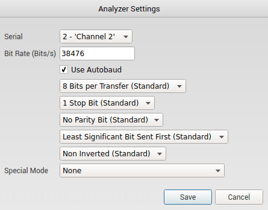
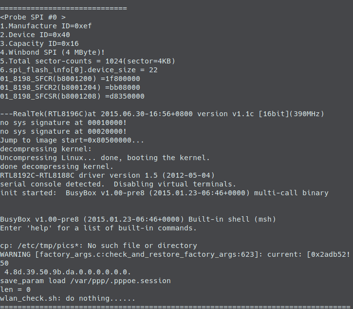

<title>Reversing Netis</title>

# Prologue

This project is basically my first foray into hardware reverse engineering. My professor's at UTSA were the ones who pushed me to branch out into hardware reverse engineering and I am eternally grateful that they did so as hardware adds an additional interesting dynamic to typical software reverse engineering.

With that being said this writeup is a work in progress and has not actually been fully completed. Below is a draft and it should be treated as such.

# The Router

The device I analyzed in this writeup is an older router from Netis, the WF2411D model. I had the model from my days when I was first discovering networking and it had been laying in a box for a couple of years until I decided to delve into hardware reverse engineering.

To begin I had to of course take the board out of its enclosure to allow me to examine it.

# Reconnaissance

After taking the board out of the enclosure I saw that my work was cut out for me as the signature UART contacts were exposed but they had no headers. There was also a flash chip on the board that I was curious of as well.

[//]: # (Take a better picture)

# Soldering

To begin examining the UART contacts I simply shined a flashlight underneath the board to show the traces that led to each contact. The middle contact clearly had a rather large trace connecting to it which indicated to me that this was power or VCC. The two contacts off to the side of the middle contact had two small traces connected to them which indicated that they were either TX or RX. Finally the outside contacts have no traces connected to them which indicated that they were both ground.

The only way to verify the identify of the middle 3 contacts was to use a voltmeter.

* The leftmost contact and the rightmost contact had continuity between each other so I assumed these were each connected to the ground plane and used them as ground.
* The inner leftmost contact was found to be TX as the voltage would often fluctuate from 3.3 Volts to around 2.75 Volts at boot which would indicate that the device was transmitting as the TX pin is supposed to held high at 3.3v when idle and dip below 3.3v when transmitting (more on this later)
* The middle contact was confirmed to be VCC or power as it was found to be at 3.3v constantly.
* The inner rightmost contact was assumed to be RX as this was the only pin remaining in the UART specification.

After determining the configuration of the pins I cleaned up the lead free solder that came from the factory using an adequate amount of flux, desoldering braid and a hot soldering iron and then installed headers so that my logic analyzer could properly make contact with the UART. Admittedly I did botch the first solder job on this board as I did not have any of the materials listed above. This fact just goes to show how important it is to have the right tools for the job.

There are three main components to success for a soldering job like this.

1. Your soldering iron must have sufficient heat for the job, the soldering iron I used for this project was a TS100 because my old analog Velleman VTSS5U soldering iron would not cut it. I soldered at 350 Celsius because more heat is generally better for this type of application because adding more time can actually cause more harm than good as it can damage the board and the components around the area you are reworking. I would also like to add that soldering to and from the ground plane on almost any device like this takes more heat as I had to go up to 420 C to melt the lead free solder quick enough to wick it and minimize damage to surrounding components.
2. Flux is a very important component for this type of project as it can essentially reduce the amount of time it takes for you to take off a component and it significantly decreasing the amount of time it takes for you to solder a new component on. It can also help limit the spread of heat to unintended areas but I would not rely on flux to do this for you. For this project I used a tube of MG Chemicals no clean flux paste.
3. Desoldering Braid makes the process of cleaning the board of preexisting lead free solder much easier as it is several pieces of copper wire that you heat up to entice the existing solder to solder to the braid instead of the contact. Desoldering braid can be found cheaply online and is mostly all the same to my knowledge.

[//]: # (Take a better picture)

# Logic Analysis

To determine the settings for the UART I used a Saleae 8 channel logic analyzer for simplicity as it is the easiest logic analyzer I have ever used and gets results quickly. I attached one channel to the TX pin on the router so that I could determine the baud rate and other settings for connecting to my Bus Pirate as a bridge. I also connected ground to ground to complete the circuit and ran the auto UART analyzer with Saleae's software.

The software yielded a baud rate of 38476 which we can round to 38400 as it is a standard baud rate on most adapters. It also determined that the settings were 8N1 which is standard for most modern serial interfaces.

Before moving on I want to make it clear that you don't need a special Logic Analyzer to determine baud rate as there is an easy formula to determine it. Below we see that the smallest peak throughout the transmission is 26 micro seconds. If we take that value and put it under one (so 1/.000026) we get 38461 baud with some change. You can also brute force the settings but that is a tedious process which is why I enjoy the logic analyzer method.

# UART

After discovering the settings I would need to use to interface with this UART using my logic analyzer I connected the device to my Bus Pirate using the standard 10 pin cable included with it while making sure **not** to connect to 3 Volt to 3 Volt and to connect TX on the router to RX on the Bus Pirate and vice versa.

This configuration yielded a working UART connection with my Bus Pirate which allowed me to watch the Router go through its boot sequence as if it was just a normal computer. This UART connection revealed that system was running Linux and immediately dropped me into a Busybox v1.00-pre8 root shell.

# Firmware Dump

After gaining access with the UART I decided to see if I could dump firmware from the onboard flash chip. So I desoldered the chip itself and put it into a soic 8 clip and used a program named FlashRom in conjunction with my Bus Pirate to dump the entire memory of the chip. After briefly analyzing the chip it wasn't clear what was contained inside the dump as Binwalk showed no known file systems. I did however find my SSID and my Password in plaintext using strings.

After analyzing the firmware it appeared that the dump and the files within it were either compressed or otherwise obfuscated. So instead of wasting time trying to understand the dump I decided to look at the firmware over UART where I already had access. I also ended up downloading the firmware from the manufacturer as well to be extra thorough.

One of the first things I saw when scanning through the various directories was a passwd file with no accompanying shadow file. This piqued my interest so I grabbed the hash and immediately attacked it using John and the rockyou password list just to see if the password was something simple or if it would take a little more effort to crack. The crack was over in a second at the most and it revealed that they had never changed the default password which was "realtek.

