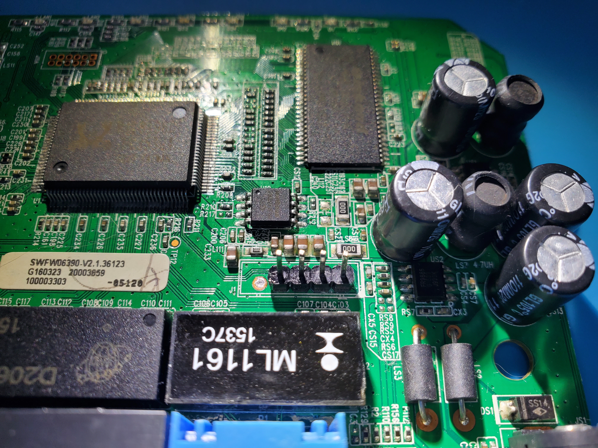

# Prologue

This project is basically my first foray into hardware reverse engineering. My professor's at UTSA were the ones who pushed me to branch out into hardware reverse engineering and I am eternally grateful that they did so as hardware adds an additional interesting dynamic to typical software reverse engineering.

With that being said this writeup is a work in progress and has not actually been fully completed. Below is a draft and it should be treated as such.

# Begin

The device I analyzed in this writeup is an older router from Netis, the WF2411D model. I had the model from my days when I was first discovering networking and it had been laying in a box for a couple of years until I decided to delve into hardware reverse engineering.

To begin I had to of course take the board out of its enclosure to allow me to examine it.

After taking the board out of the enclosure I saw that my work was cut out for me as the signature UART contacts were exposed but they had no headers. There was also a flash chip on the board that I was curious of as well.

To begin examining the UART contacts I simply shined a flashlight underneath the board to show the traces that led to each contact. The middle contact clearly had a rather large trace connecting to it which indicated to me that this was power or VCC. The two contacts off to the side of the middle contact had two small traces connected to them which indicated that they were either TX or RX. Finally the outside contacts have no traces connected to them which indicated that they were both ground.

The only way to verify the identify of the middle 3 contacts was to use a voltmeter.

* The leftmost contact and the rightmost contact had continuity between each other so I assumed these were each connected to the ground plane and used them as ground.
* The inner leftmost contact was found to be TX as the voltage would often fluctuate from 3.3 Volts to around 2.75 Volts at boot which would indicate that the device was transmitting as the TX pin is supposed to held high at 3.3v when idle and dip below 3.3v when transmitting (more on this later)
* The middle contact was confirmed to be VCC or power as it was found to be at 3.3v constantly.
* The inner rightmost contact was assumed to be RX as this was the only pin remaining in the UART specification.
