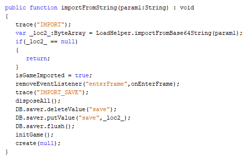
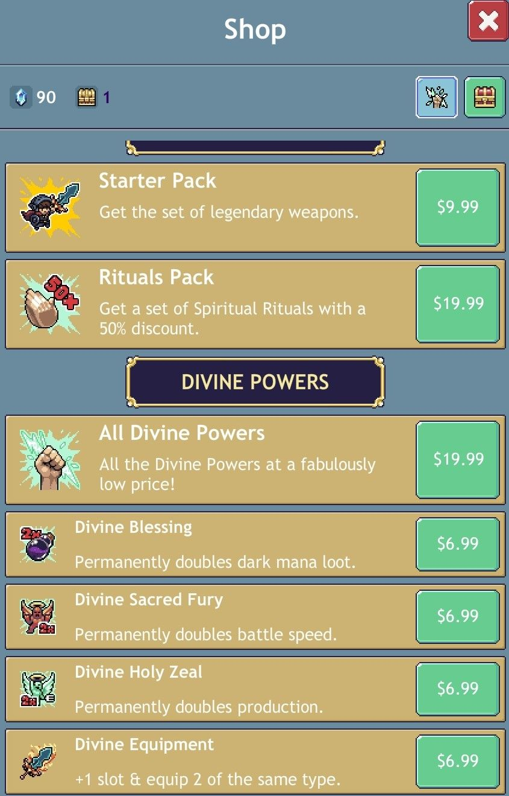

# Prologue

For this project I took a lot of inspiration from LiveOverflow as in a video he advises viewers to reverse engineer games
if they feel as if they are becoming unproductive due to these games. This writeup is the embodiment of that mentality.

# The Game

The game in question was an addictive idle game called Cave Heroes which is a remake of a flash game called Cave Heroes originally
on PC. After wasting many days playing this game instead of *reading* or doing *anything productive* I decided to take a look under
the hood of the game to see if there were any potential vulnerabilities. What really made me take a closer look at this game was the
fact that it allowed me to export saves into a text form which is really rare now with cloud saving becoming the norm.

# Reconnaissance

The first step to analyzing any Android application is obtaining the APK. For this writeup I used an [online resource](https://apkpure.com)
that keeps copies of the APKs from the Android Market for download. I then simply renamed the APK to a ZIP and extracted the files within.
I had a suspicion that this game was a Unity game so I immediately started to browse into the assets folder as this is normally where the
.dll files are located for Unity mobile games. Instead of any reference to Unity I found a .swf file which indicates that this game was
made in flash just like the original which is interesting to me as flash on Android has been steadily decreasing in popularity.

# Decompiling Flash

It is fortunate that Flash is trivial to decompile when using [JPEXS](https://www.free-decompiler.com/flash/) which has been my most
valued tool for every Flash project that I have undertaken. It is also fortunate that Action Script is easy to pick up as my knowledge
of it was hazy at best before beginning this project.

As soon as I opened up the Flash file I immediately began hunting for any function that dealt with saving or loading as my target for
this project was undoubtedly the save format. With a little hunting I found the handlers section which was full of exporting and importing
methods.

# Save Handlers

The Handlers folder was a goldmine of useful information for Reverse Engineering the save format. The first step was to find out how
the save string was created which I determined by finding the export to clipboard function and branching my search out from there.

## exportToClipboard

From looking at the exportToClipboard function we are able to determine that getXMLSave is called first then it is compressed into a
byte array using a function named xmlToCompressedByteArray and then the compressed data is base64 encoded. After these operations
take place the resulting base64 encoded strings is placed into the clipboard.

## getXMLSave

By taking a look at the getXMLSave function we are able to determine that the *important* save data comes from a function named getSave.
It also appears that whenever getXMLSave is called the game may be saved but I was unable to verify this.

## getSave

The getSave function is where the Reverse Engineering begins to get interesting because within this function we begin to see the
start of an XML structure which includes fields for date, version, level, portalAllowed, battleSpeed, endless, and purchases. The purchases
field appears to be several items long from the use of a for loop to parse it.

Several important things stood out to me while I was looking through this. The fact that purchases is in the save file format was a strong
indicator that purchases could be changed using a generated save string, also the battleSpeed which is very important to the mechanics of the game could presumably be altered using a generated save string as well.

## Premium Options

By taking a look at the saveTo function referenced in getSave I was able to determine exactly what each premium option was which was very
useful for when I began to alter save files later in the writeup.

# Reversing Save Strings

I initially got the save string into a readable form by using [Cyber Chef](https://gchq.github.io/CyberChef/) which is an amazing tool that
I primarily use for attempting to deobfuscate unknown formats which it excels at. Firstly, I base64 decoded the save string as that was the
last layer applied to the string in exportToClipboard.

Decoding this string yielded a garbled mess which very much reminded me of compressed data. So I tried several different methods for
decompressing this data and in the end ZLib was determined to be the compression algorithm that was used to compress this string.

After decompression the save string was readable in its entirety and was easily editable as it is XML. There were several fields that
were labeled ambiguously on purpose which was an interesting last ditch effort to preserve the integrity of the file format.

# Import Menu

Finding the import menu was interesting as I actually found it on accident! I actually do quite like this game so I am an active member
of the Discord and do watch the updates whenever they show up. Imagine my surprise when the developer detailed a method of opening the
hidden import menu to import save strings.

I had long suspected that there was an import menu because there was a function named importFromString which decodes and updates the save
in the DB object from the given string but I had not taken the proper amount of time to search for it so I was very happy when this was
publicly revealed in Discord.

The import menu was relatively easy to open while remaining well hidden. All a user had to do was open and close the settings menu rapidly
until they are blessed with the fabled import menu.

# Generating Save Strings

After learning how to deobfuscate the exported strings I then reversed the deobfuscation process and compressed the XML first before base64
encoding the string which yielded a valid save string. I then tested this with a normal unedited save which yielded me a normal game upon
import.

After nailing down a reliable method for generating valid save strings I began editing the strings to see if any sort of restrictions were
enforced (Although I saw none in the game logic). My first change was to swap every premium option to turned on to test the waters.

Importing this save yielded a game with every single permanent upgrade registering as purchased which gave me a handful of perks in the
game.

I didn't just stop at activating the packs in this game. There are two premium currencies in this game, crystals and chest charges. These
were nowhere to be found by name in the decoded save string. To find the values I instead looked for the values that these currencies were
set to when I generated the save file which was 90 for crystals and 1 for chest charges. Looking by value yielded two fields with seemingly
randomized names. So I promptly added several zeroes to each field to make it easy to identify if the changes were successful or not.

After importing the save file with all premium packs turned on and the currency boosted I was greeted with the boosted amounts of currency
for each field which was a welcome sight.

# Summary

Although the Reverse Engineering portion of this project was not too intensive I still had loads of fun during this project. LiveOverflow
was correct in turning a game into a learning experience because I have no need to play the game anymore because I can basically boost
myself into oblivion now.

I do plan on eventually making a full editor for save strings and if I do I will most certainly add it to this writeup.

Thank you so much for reading through this and I sincerely hope that you learned something, if you have any feedback don't hesitate to email me at <NealsSec@protonmail.com>!
